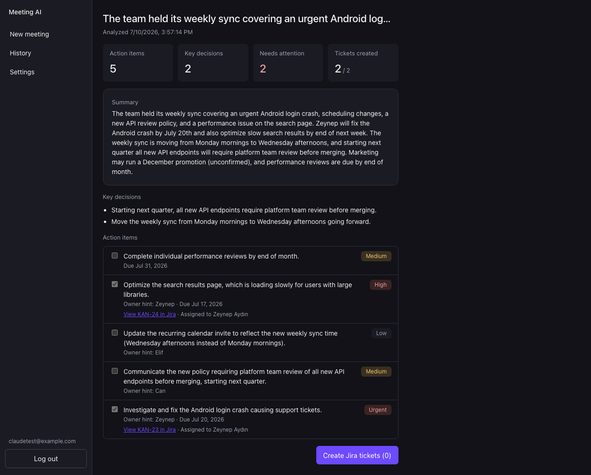
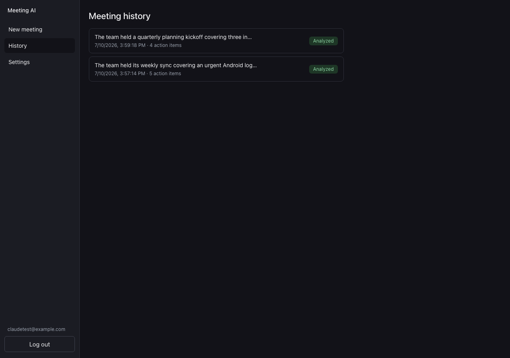
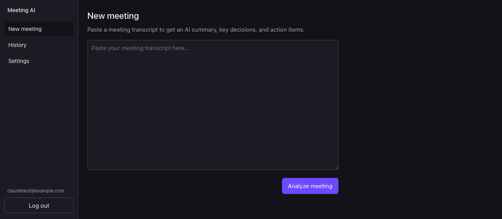
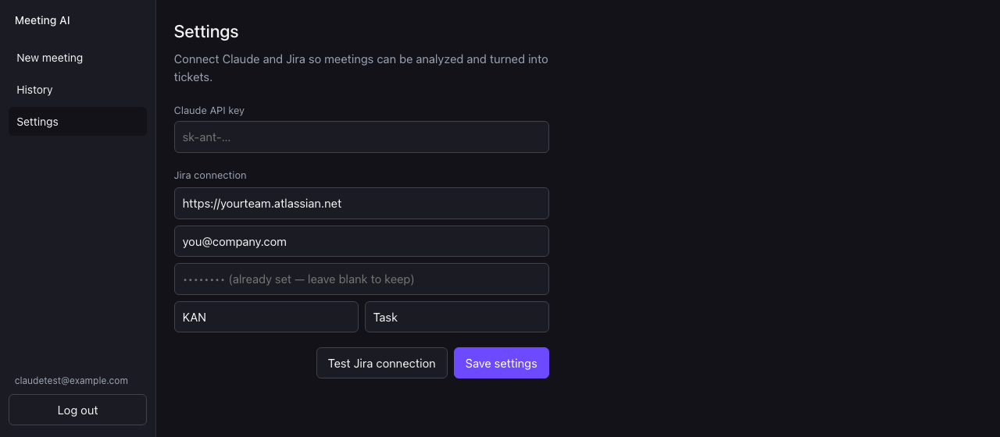
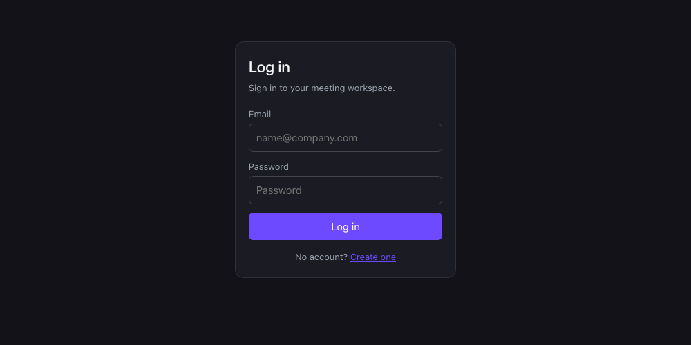

# AI Meeting Assistant

Paste a meeting transcript, get an AI-generated summary, key decisions, and action items, and turn the ones that need follow-up into real Jira tickets.

## Screenshots

| Analysis review | Meeting history |
|---|---|
|  |  |

| New meeting | Settings | Login |
|---|---|---|
|  |  |  |

## Stack

- **Backend**: ASP.NET Core Web API (.NET 10), EF Core + PostgreSQL, ASP.NET Core Identity + JWT auth
- **Frontend**: React + TypeScript (Vite), React Router, TanStack Query
- **AI**: Claude API (Anthropic)
- **Tickets**: Jira Cloud REST API

## Repository layout

```
backend/    ASP.NET Core solution (Api / Core / Infrastructure)
frontend/   Vite + React + TypeScript app
docs/       plan/notes
```

## Prerequisites

- .NET 10 SDK
- `dotnet-ef` CLI tool: `dotnet tool install --global dotnet-ef` (needed to run/create EF Core migrations)
- Node.js 20+
- PostgreSQL (local install, or via Docker: `docker run --name meeting-assistant-db -e POSTGRES_PASSWORD=postgres -e POSTGRES_DB=ai_meeting_assistant -p 5433:5432 -d postgres:16` — port 5433 is used here since 5432 may already be bound on your machine; adjust the connection string port to match whatever you use)
- An Anthropic API key (for Claude analysis)
- A Jira Cloud site, account email, and API token (for ticket creation) — enter these on the app's Settings page after logging in, or set them via the API (see below)

## Running locally

### Backend

```
cd backend
dotnet user-secrets init --project src/AiMeetingAssistant.Api
dotnet user-secrets set "ConnectionStrings:Default" "Host=localhost;Port=5433;Database=ai_meeting_assistant;Username=postgres;Password=postgres" --project src/AiMeetingAssistant.Api
dotnet user-secrets set "Jwt:SigningKey" "$(openssl rand -base64 48)" --project src/AiMeetingAssistant.Api
dotnet ef database update --project src/AiMeetingAssistant.Infrastructure --startup-project src/AiMeetingAssistant.Api
dotnet run --project src/AiMeetingAssistant.Api
```

API listens on `http://localhost:5130` by default (see `Properties/launchSettings.json`). Health check: `GET /api/health`.

Auth endpoints: `POST /api/auth/register`, `POST /api/auth/login` (both return a JWT), `GET /api/auth/me` (requires `Authorization: Bearer <token>`).

To use transcript analysis, set a fallback Claude API key: `dotnet user-secrets set "Claude:ApiKey" "sk-ant-..." --project src/AiMeetingAssistant.Api`. Individual users can also save their own Claude key from the Settings page, which takes priority over this fallback. Meeting endpoints: `POST /api/meetings` (analyzes a transcript), `GET /api/meetings`, `GET /api/meetings/{id}`, `POST /api/meetings/{id}/jira-tickets` — all require `Authorization: Bearer <token>`.

Settings endpoints (all per-user, require `Authorization: Bearer <token>`): `GET/PUT /api/settings` (Claude key, Jira base URL/email/API token/default project key/default issue type — secrets are write-only and masked on read), `POST /api/settings/test-jira-connection`.

### Frontend

```
cd frontend
cp .env.example .env.local
npm install
npm run dev
```

App runs on `http://localhost:5173` and talks to the API via `VITE_API_BASE_URL`.

## Status

Core build plan complete — see [docs/plan.md](docs/plan.md) for the full build plan.

- [x] Phase 0: scaffold
- [x] Phase 1: auth (ASP.NET Core Identity + JWT), app shell, login/register UI
- [x] Phase 2: transcript → Claude analysis → review UI (verified live against the Anthropic API)
- [x] Phase 3: settings + Jira ticket creation (verified live against a real Jira Cloud site)
